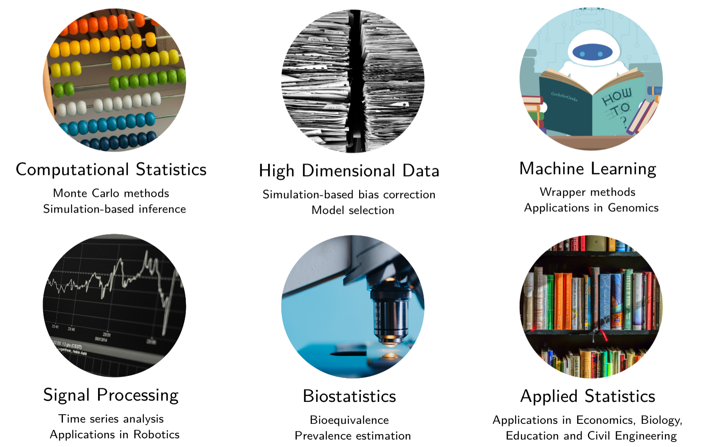

```{R, setup, include = F}
# devtools::install_github("dill/emoGG")
library(pacman)
p_load(
  broom, tidyverse,
  latex2exp, ggplot2, ggthemes, ggforce, viridis, extrafont, gridExtra,
  kableExtra, snakecase, janitor,
  data.table, dplyr, estimatr,
  lubridate, knitr, parallel,
  lfe,
  here, magrittr
)
# Define pink color
red_pink <- "#e64173"
turquoise <- "#20B2AA"
orange <- "#FFA500"
red <- "#fb6107"
blue <- "#2b59c3"
green <- "#8bb174"
grey_light <- "grey70"
grey_mid <- "grey50"
grey_dark <- "grey20"
grey = "#b4b4b4"
purple <- "#6A5ACD"
slate <- "#314f4f"
blue2 <- "#06bcf1"
# Dark slate grey: #314f4f
# Knitr options
opts_chunk$set(
  comment = "#>",
  fig.align = "center",
  fig.height = 7,
  fig.width = 10.5,
  warning = F,
  message = F
)
opts_chunk$set(dev = "svg")
options(device = function(file, width, height) {
  svg(tempfile(), width = width, height = height)
})
options(crayon.enabled = F)
options(knitr.table.format = "html")
# A blank theme for ggplot
theme_empty <- theme_bw() + theme(
  line = element_blank(),
  rect = element_blank(),
  strip.text = element_blank(),
  axis.text = element_blank(),
  plot.title = element_blank(),
  axis.title = element_blank(),
  plot.margin = structure(c(0, 0, -0.5, -1), unit = "lines", valid.unit = 3L, class = "unit"),
  legend.position = "none"
)
theme_simple <- theme_bw() + theme(
  line = element_blank(),
  panel.grid = element_blank(),
  rect = element_blank(),
  strip.text = element_blank(),
  axis.text.x = element_text(size = 18, family = "STIXGeneral"),
  axis.text.y = element_blank(),
  axis.ticks = element_blank(),
  plot.title = element_blank(),
  axis.title = element_blank(),
  # plot.margin = structure(c(0, 0, -1, -1), unit = "lines", valid.unit = 3L, class = "unit"),
  legend.position = "none"
)
theme_axes_math <- theme_void() + theme(
  text = element_text(family = "MathJax_Math"),
  axis.title = element_text(size = 22),
  axis.title.x = element_text(hjust = .95, margin = margin(0.15, 0, 0, 0, unit = "lines")),
  axis.title.y = element_text(vjust = .95, margin = margin(0, 0.15, 0, 0, unit = "lines")),
  axis.line = element_line(
    color = "grey70",
    size = 0.25,
    arrow = arrow(angle = 30, length = unit(0.15, "inches")
  )),
  plot.margin = structure(c(1, 0, 1, 0), unit = "lines", valid.unit = 3L, class = "unit"),
  legend.position = "none"
)
theme_axes_serif <- theme_void() + theme(
  text = element_text(family = "MathJax_Main"),
  axis.title = element_text(size = 22),
  axis.title.x = element_text(hjust = .95, margin = margin(0.15, 0, 0, 0, unit = "lines")),
  axis.title.y = element_text(vjust = .95, margin = margin(0, 0.15, 0, 0, unit = "lines")),
  axis.line = element_line(
    color = "grey70",
    size = 0.25,
    arrow = arrow(angle = 30, length = unit(0.15, "inches")
  )),
  plot.margin = structure(c(1, 0, 1, 0), unit = "lines", valid.unit = 3L, class = "unit"),
  legend.position = "none"
)
theme_axes <- theme_void() + theme(
  text = element_text(family = "Fira Sans Book"),
  axis.title = element_text(size = 18),
  axis.title.x = element_text(hjust = .95, margin = margin(0.15, 0, 0, 0, unit = "lines")),
  axis.title.y = element_text(vjust = .95, margin = margin(0, 0.15, 0, 0, unit = "lines")),
  axis.line = element_line(
    color = grey_light,
    size = 0.25,
    arrow = arrow(angle = 30, length = unit(0.15, "inches")
  )),
  plot.margin = structure(c(1, 0, 1, 0), unit = "lines", valid.unit = 3L, class = "unit"),
  legend.position = "none"
)
theme_set(theme_gray(base_size = 20))
# Column names for regression results
reg_columns <- c("Term", "Est.", "S.E.", "t stat.", "p-Value")
# Function for formatting p values
format_pvi <- function(pv) {
  return(ifelse(
    pv < 0.0001,
    "<0.0001",
    round(pv, 4) %>% format(scientific = F)
  ))
}
format_pv <- function(pvs) lapply(X = pvs, FUN = format_pvi) %>% unlist()
# Tidy regression results table
tidy_table <- function(x, terms, highlight_row = 1, highlight_color = "black", highlight_bold = T, digits = c(NA, 3, 3, 2, 5), title = NULL) {
  x %>%
    tidy() %>%
    select(1:5) %>%
    mutate(
      term = terms,
      p.value = p.value %>% format_pv()
    ) %>%
    kable(
      col.names = reg_columns,
      escape = F,
      digits = digits,
      caption = title
    ) %>%
    kable_styling(font_size = 20) %>%
    row_spec(1:nrow(tidy(x)), background = "white") %>%
    row_spec(highlight_row, bold = highlight_bold, color = highlight_color)
}
```

```{css, echo = F, eval = F}
@media print {
  .has-continuation {
    display: block !important;
  }
}
```

```{r xaringan-tile-view, echo=FALSE}
xaringanExtra::use_tile_view()
xaringanExtra::use_panelset()
xaringanExtra::use_clipboard()
xaringanExtra::use_extra_styles()
```


class: title-slide  
<div class="my-logo-right"></div>
<br>
<br>
<br>
<br>
 
# IOM PhD Day - Friday 18 June 2021

## SWAG: A Wrapper Method for Sparse Learning

<br>
### .smaller[Stéphane Guerrier]


---

# .smallest[Research Areas]

<br>
```{R, torture, out.width = "95%", echo = F}

```

---

# .smallest[A New Wrapper Method for Sparse Learning]

.pull-left[

```{R, out.width = "100%", echo = F}
include_graphics("pics/SWAG2.png")
```

.smaller[📄 [https://arxiv.org/abs/2006.12837](https://arxiv.org/abs/2006.12837)]

]
.pull-right[

<br>
```{R, out.width = "100%", echo = F}
include_graphics("pics/network_breast_paper.png")

```

.smallest[Example of .hi.purple[predictive network] based on the breast cancer dataset of Haakensen et al. (2016)].

.smaller[SWAG R 📦 available on CRAN [here](https://cran.r-project.org/web/packages/swag/index.html).]


]


---

# .smallest[Logistic Regression]

- In statistics, the .hi.purple2[logistic model] is used to .purple2[model the probability of a certain event existing] such as pass/fail, healthy/sick or buying/not buying an item.
- In most (modern) empirical studies, a large number of variables are measured (often larger than the number of observation) and therefore researchers generally try to .purple2[identify the smallest possible set of variables that can still achieve good predictive performance]. This taks is often referred to as model (or variable) selection.

How statisticians (typically) understand this definition:
- We are looking for a .pink[single model].
- For a given candidate model, picking the .pink[most likely parameters] given the data is optimal (i.e.  maximum likelihood estimation).
- Predictive performance can be measured by the .pink[likelihood function] (typically out-of-sample criteria such as AIC or BIC).

---

# .smallest[Is this a good idea?] 🤔

According to our understanding of the problem (i.e. .purple2[single model based on likelihood methods]): .hi.pink[YES!] 

However, this approach has some drawbacks:

- Focusing on a .hi.purple2[single model suggests a level of confidence in our final result that is not justified by the data] as other models generally exist with similar goodness of fit.
- Maximizing the likelihood function .purple2[does not guarantee finding the best model(s)] (and parameters) according to a given out-of-sample objective function.
- These methods are prone to .purple2[overfitting] (due to the asymmetric effects of "under" vs "over" fitting).

---

# .smallest[How to address these limitations?]

- A possible solution is the .pink[SWAG algorithm] proposed in Guerrier et al. (2016) and later improved in Molinari et al. (2021). This .purple2[wrapper] method aims to alleviate (some of) these issues and .purple2[is build "on top" of an arbitrary predictive method] (e.g. logistic regression, random forest, ANN, ...). 
- Its goals are the following:
    - Finding ALL models (and parameters) minimizing an out-of-sample objective function (e.g.  classification error).
    - Restricting our attention to the models with the smallest dimension.
- As an example, we applied in Guerrier et al. (2016) our methodology to well-known dataset on the .purple2[classification of Acute Myeloid Leukemia (AML) against Acute Lymphoblastic Leukemia (ALL)] (see Golub et al., 1999).

---

# .smallest[Leukemia Dataset]

.panelset[
.panel[.panel-name[Classification error]

```{R, out.width = "90%", echo = F}

```

<center>
.tiny[Adapted from Guerrier et al. (2016).]
</center>


]
.panel[.panel-name[SWAG-based network]

<br>
```{R, out.width = "100%", echo = F}
include_graphics("pics/network.png")
```

<br>

<center>
.tiny[Adapted from Guerrier et al. (2016).]
</center>

]
]

---

# .smallest[Context of the analysis]

- Most statistical methods are used to deliver estimates and predictions for different problems with .purple2[the goal of using these results for decision-making] (e.g. whether a patient should be treated, selecting a drug or its dosage, marketing strategy, ...). 
- The vast majority of these methods are .hi.pink[independent] of the context of this decision-making process and the approach used to obtain model's parameters (and prediction) is .hi.pink[fixed] for all applications.
- This can lead to .puple2[contradictory examples] (e.g.  asymmetric "risk" of treating vs not treating a patient). Indeed, not all prediction errors are the "same" or have similar "impacts".
- The SWAG allows to .purple2[incorporate] the "context" of the decision-making (e.g. weighted risks).

---

# .smallest[Not all classification errors are the same...] 🙄

.pull-left[
<br>
```{R, out.width = "65%", echo = F}
include_graphics("pics/fun1.png")
```

<center>
.hisg[Type I error] (false positive)
</center>

]
.pull-right[
<br>
```{R, out.width = "65%", echo = F}

```

<center>
.hisg[Type II error] (false negative)
</center>

]

---

# .smallest[Example: Customer churn]

- Customer churn or attrition corresponds to the loss of clients or customers.
- Banks, telephone service companies, Internet service providers and other similar companies, often use customer attrition rates as one of their .purple2[key business metrics].
- Adequate (probabilistic) modeling of customer churn is therefore a problem of interest. A .purple2[classical and standard approach to model such data] is following:
    - Model the data using logistic regression.
    - Select the variables using the AIC (or other similar criteria) in a stepwise (greedy) manner (a popular alternative would be based on the lasso).
    - Make inference on the variables of interested based on the MLE on the selected model (⚠️ as if the model was known! ⚠️).


---

# .smallest[Customer churn: Dataset]

We consider the [*Telco customer churn*](https://community.ibm.com/community/user/businessanalytics/blogs/steven-macko/2019/07/11/telco-customer-churn-1113) that provides information about .purple2[customers of a telecom company and whether or not they left the company].

The data set includes information about:

- .pink[Customers who left within the last month]
- .pink[Services that each customer has signed up for] (e.g. phone, multiple lines, internet, online security, ...)
- .pink[Customer account information] (e.g. how long they have been a customer, contract, payment method, ...)
- .pink[Demographic info] (e.g. gender, age range, ...)

This dataset is relatively large with $10^4$ observations and more than $50$ variables.

```{r, echo = F, warning =F}
library(readr)
customer_churn <- read_csv("data/customer_churn.csv")
# head(customer_churn)
```

---

# .smallest[Customer churn: standard analysis]

```{r, echo=F}
# load("data/selected_model_aic.rda")
# df_1 = summary(selected_model_aic)
# df_1$coefficients %>%
#   kable("html") %>%
#   kable_styling(font_size = 12)

# lolipop chart pvalue
load("data/selected_model_aic.rda")
df_1 = summary(selected_model_aic)
# df_1$coefficients[,4]
x = names(df_1$coefficients[,4])
y = df_1$coefficients[,4]
df_pval = data.frame("pvalue" = y, "variable" = x)
df_pval = df_pval%>% arrange(pvalue)
par(mar=c(6,18,6,1))
plot(df_pval$pvalue,seq(length(df_pval$variable)),
     ylab = "",pch=16 ,xlab="p-value",
     main = "Variable significance",
     cex=1.5, yaxt='n', cex.axis=1.5, cex.lab = 2)
vec_name = df_pval$variable
vec_name_2 = str_replace(vec_name, pattern = "_", replacement = " ")
vec_name_3 = str_replace(vec_name_2, pattern = "_x_", replacement = " ")
vec_name_4 = str_replace(vec_name_3, pattern = "x_", replacement = " ")
vec_name_5 = str_replace(vec_name_4, pattern = "_", replacement = " ")
axis(side = 2, at = seq(length(df_pval$pvalue)), 
     labels = vec_name_5, las = 2, cex.axis = 1.2)
for(i in seq(length(vec_name_5))){
  segments(x0 = 0, y0 = i, x1 = df_pval[i, "pvalue"], y1 = i)
}
abline(v = .05)
text(x = .06, y = 4, "0.05", cex = 1.5)

```


---

# .smallest[Customer churn: SWAG-based Analysis]

```{r, echo =F}
library(MASS)
library(boot)
library(ggplot2)
library(widgetframe)

# load external file
source("R/return_glm.R")

# load results from swag
load("data/train_swag_glm_no_int.rda")
load("data/df_telco_no_int.rda")
load("data/selected_model_aic.rda")

###########################################
# graph to show the cv error
###########################################

# select best models
summary_swag_glm_no_int = summary(train_swag_glm_sub,min_dim_method = "min", min_dim_min_cv_error_quantile = .25)

#return cv of selected models

dimension_cv = extract_cv_best_model(train_swag_glm_sub,min_dim_method = "min",
                                     min_dim_min_cv_error_quantile = .25)
dim_mdl_aic = length(coefficients(selected_model_aic))

cost = function(resp, pred){
  mean(resp == (pred > 0.5))
}

out_accuracy = cv.glm(df_telco_no_int, selected_model_aic, cost, K = 10)$delta[2]
error_aic_selected = 1- out_accuracy


g1 = ggplot(dimension_cv, aes(x=dimension,y=cv, colour =  best_model))+
  geom_point(position = "jitter") + xlab("Model dimension")+
  scale_color_manual(values = c("#00008B80", "#FF8C0080")) +
  ylab("Cross-Validation Error") +
  ylim(0.19, 0.23)+
  theme_minimal(base_size = 20) + 
  geom_point(aes(x=dim_mdl_aic, y=error_aic_selected), 
             colour="red", size =5, alpha =.5)+
  annotate("segment", x = dim_mdl_aic-1, xend = dim_mdl_aic , 
           y = error_aic_selected+.02, yend = error_aic_selected, 
           colour = "red", size=1, alpha=0.5, arrow=arrow()) +
  annotate("text", x = dim_mdl_aic-1, y = error_aic_selected+.025,
           label = "stepwise AIC \n selected model") + 
  xlim(5,20)+ theme(legend.position = "none")


l = plotly::ggplotly(g1)

frameWidget(l, width='100%', height='40%')
```

---

```{r, echo = F}
# density plot error
dimension_cv_sub = dimension_cv %>% filter(best_model == 1)
g2 = ggplot(dimension_cv) +
  aes(x = cv) +
  geom_density(adjust = 1L, fill = "#cae2f9") +
  theme_minimal(base_size = 22) + ylab("Density")+
  xlab("Cross-Validation Error") + geom_vline(xintercept =  error_aic_selected)+

  annotate("text", x = .212, y = 65,
           label = "Cross-Validation Error \n of AIC selected model") +
  ggtitle("Cross Validation Error of all models") + ylim(0,80)

g3 =  plotly::ggplotly(g2)
frameWidget(g3, width='100%', height='40%')
```


---
# SWAG NETWORK

We can represent the relationship between variables in the best performing models (with respect to the estimated out of sample error) with a chord diagram. Each chord represent the number of time two variables were included in a model among the best performing models.

---

# afklsgn

<div align="center">

```{r, echo =F, fig.align='center'}
library(chorddiag)
load("data/mat_3.rda")
diag(mat_3) = 0
mat_3[lower.tri(mat_3)]  <- t(mat_3)[lower.tri(mat_3)]
isSymmetric(mat_3)
complete_names = colnames(mat_3)
abr = substr( complete_names , start = 1 , stop = 3 )
rownames(mat_3) = abr
colnames(mat_3) = abr
l2 = chorddiag(mat_3, groupnamePadding = 10, categorynameFontsize = 6, tooltipNames = complete_names)
l2
frameWidget(l2,  width ='100%')

```

</div>


---

# SWAG MACHINE LEARNING


---

# .smallest[Thank you very much for your attention!]

```{R, med2, out.width = "65%", echo = F}
include_graphics("pics/medical_studies2.png")
```

.footnote[.smallest[👋] Read the original article: "*This is why you shouldn’t believe that exciting new medical study*" [here](https://www.vox.com/2015/3/23/8264355/research-study-hype).]
